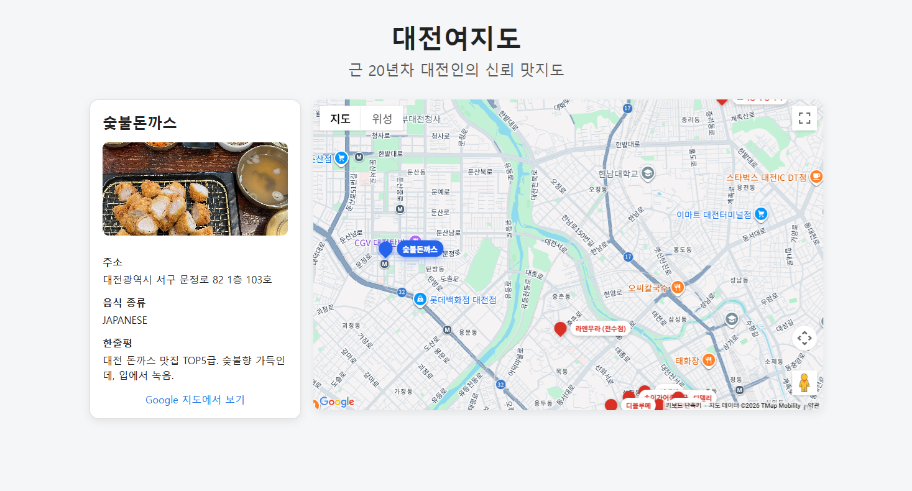
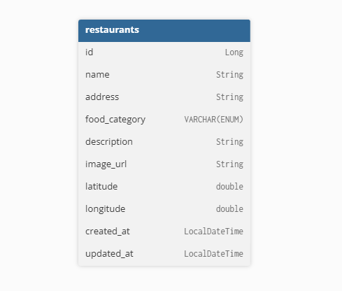
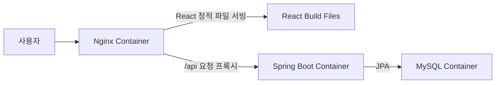

# 🗺️ 대전여지도 🗺️ #
### Google Maps API와 Spring Boot REST API를 활용한 맛집 지도 웹 토이 프로젝트

대전여지도는 대전의 맛집 데이터를 지도 위에 시각화한 웹 프로젝트입니다.    
Spring Boot로 맛집 REST API를 제공하고, React와 Google Maps API를 활용하여 
음식점 위치를 지도 마커로 표시합니다.

## 1. 배포 주소
- 배포 환경: AWS EC2 Ubuntu + Docker Compose
- 배포 URL: http://3.37.124.133/
- API 예시: http://3.37.124.133//api/restaurants

## 2. 프로젝트 목표
이 프로젝트는 단순 맛집 목록 서비스가 아닌,
**위치 기반 데이터와 지도 UI를 연결하는 흐름**을 직접 구현하는 것을 목표로 했습니다.  

주요 목표는 다음과 같습니다.
- Spring Boot REST API 설계
- MySQL 기반 맛집 데이터 관리
- React에서 API 데이터를 받아 지도 마커로 시각화
- Google Maps API 연동
- Docker Compose 기반 로컬/배포 환경 구성
- Nginx를 이용한 React build 파일 서빙 및 `/api` 프록시 구성
- AWS EC2 배포

## 3. 기술 스택
### backend
- Java
- Spring Boot
- Spring Web
- Spring Data JPA
- MySQL
### Frontend
- React
- JavaScript
- Vite
- @vis.gl/react-google-maps
- CSS (ai 활용)
### Infra / Deployment
- Docker
- Docker Compose
- AWS EC2
- Nginx

## 4. 주요 기능
### 맛집 지도 표시
- 대전 맛집 데이터를 Google Map 위에 마커로 표시
- 음식점 이름을 마커 라벨로 표시
- 지도 중심 좌표를 대전 기준으로 설정

## 5. ERD 설계

## 6. 시스템 구조

운영 환경에서는 React 개발 서버를 직접 사용하지 않고, React를 정적 파일로 빌드한 뒤 Nginx 컨테이너가 이를 서빙합니다. 또한 프론트엔드에서 발생하는 `/api` 요청은 Nginx reverse proxy를 통해 Spring Boot 컨테이너로 전달됩니다.

 

### 향후 개선 방향
- 음식점 검색 기능 추가
- 카테고리별 필터링 기능 추가
- 사용자 리뷰 및 평점 기능 추가
- 관리자 페이지를 통한 맛집 데이터 관리
- 도메인 연결 및 HTTPS 적용
- Google Places API 기반 데이터 확장 검토
